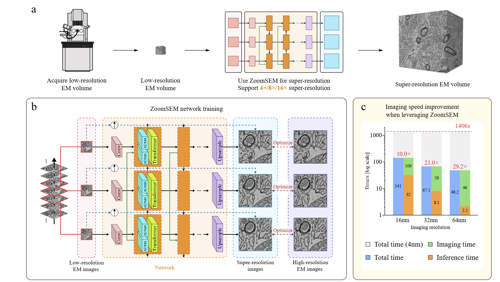

# ZoomSEM: Accelerating Large-scale Electron Microscopy with Real-world Data-driven Super-resolution
**for Nature Methods review**  
Jiateng Shou, Zhiwei Xiong*, Ruikang Xu, Zhicheng Wang, Peiyao Shi, Te Shi, Haiqun Jin, Chunying Yin, Jun Guo, Manfred Auer, Ruobing Zhang*, Feng Wu* 

MoE Key Laboratory of Brain-inspired Intelligent Perception and Cognition, University of Science and Technology of China, Hefei, China

Anhui Province Key Laboratory of Biomedical Imaging and Intelligent Processing, Institute of Artificial Intelligence, Hefei Comprehensive National Science Center, Hefei, China

Institute for Brain and Intelligence, Fudan University, Shanghai, China

Department of Biomedical Engineering, School of Biological Sciences and Medical Engineering, Southeast University, Nanjing, China

*Corresponding Author



## Code instruction
We provide implementation code and pre-trained models for reproducing the paper’s main results on all three datasets.

## Data availability
We provide part of the test dataset for review.
Please put all the trained models in the corresponding folders.

|      RealSEM-Pair      |     Acini     |     Mouse striatum     |
|:---------------:|:-----------:|:-----------:|
| [GoogleDrive](https://drive.google.com/drive/folders/1PGG67VGKnX4is2ht4UzF-aF2AgsE_L3x?usp=drive_link) | [GoogleDrive](https://drive.google.com/drive/folders/152P8Uy-hms7hCVpC-JFhtzWPYpbixZmd?usp=drive_link) | [GoogleDrive](https://drive.google.com/drive/folders/1pepGlGRy6N8dTV1Sb7DcqCSLaBoEE4oA?usp=drive_link) |

## Requirements
Our implementation is based on a **conda environment**.  
We provide a `requirements.txt` file that specifies all the necessary libraries.  
Please set up the environment accordingly before running the code.

## Inference code
Please put all the trained models in the 'pretrained' folder.

|   ZoomSEM_x4 |  ZoomSEM_x8  | ZoomSEM_x16  | ZoomSEM_FT_x4  |  ZoomSEM_FT_x8  | ZoomSEM_FT_x16  |
|:---------------:|:---------------:|:---------------:|:---------------:|:---------------:|:---------------:|
| [GoogleDrive](https://drive.google.com/file/d/1KJ7SXZG2YEjMtaKfUFVRcRA13yzH7KUL/view?usp=drive_link) | [GoogleDrive](https://drive.google.com/file/d/1nPO0h4QpfqVjJDFytJGotvLYfO7RQ9SD/view?usp=drive_link) | [GoogleDrive](https://drive.google.com/file/d/1jNi7aOwwiSzcLrr12Q4NuT7qWX8BqYhM/view?usp=drive_link) | [GoogleDrive](https://drive.google.com/file/d/1xq2_J1R6smX5um4gefc4GIGO_GrdgiLp/view?usp=drive_link) | [GoogleDrive](https://drive.google.com/file/d/1_QLdokYT2GSDfJVS6mB7H-DrahFBV43i/view?usp=drive_link) | [GoogleDrive](https://drive.google.com/file/d/169CUcylDYn2BrzkJrpVmdnlBC1FTzor4/view?usp=drive_link) |

### RealSEM-Pair
```sh
cd output_RealSEM-Pair
python output_ZoomSEM_x4.py # for 4x super-resolution
python output_ZoomSEM_x8.py # for 8x super-resolution  
python output_ZoomSEM_x16.py # for 16x super-resolution
```

### Acini
```sh
cd ../output_Acini
python output_ZoomSEM_x4.py # for 4x super-resolution
python output_ZoomSEM_x8.py # for 8x super-resolution  
python output_ZoomSEM_x16.py # for 16x super-resolution
```

### Mouse striatum 
```sh
cd ../output_Mouse_striatum
python output_ZoomSEM_x8.py # for 8x super-resolution
```

## Contact
If you have any problem with the released code and datasets, please contact us by email ([shoujt@mail.ustc.edu.cn](mailto:shoujt@mail.ustc.edu.cn)) or open an issue.

## Acknowledgment
We acknowledge the following contributors whose code served as the basis for our work:
[PSRT](https://github.com/XPixelGroup/RethinkVSRAlignment) and [BasicVSR++](https://github.com/ckkelvinchan/BasicVSR_PlusPlus).
